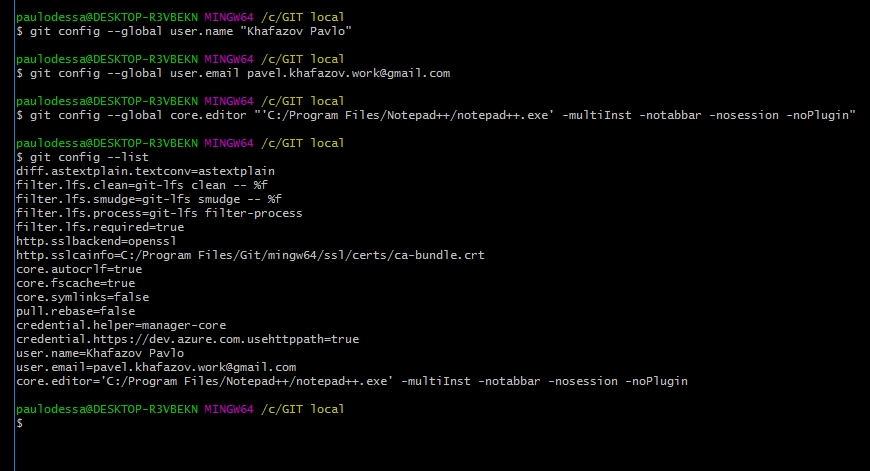
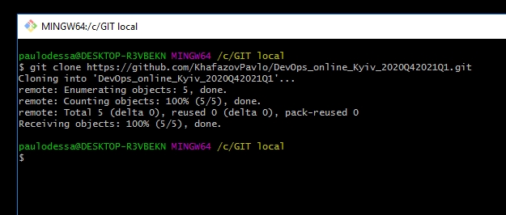
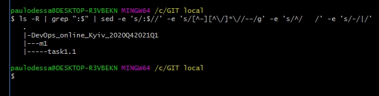
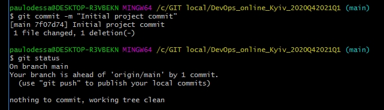
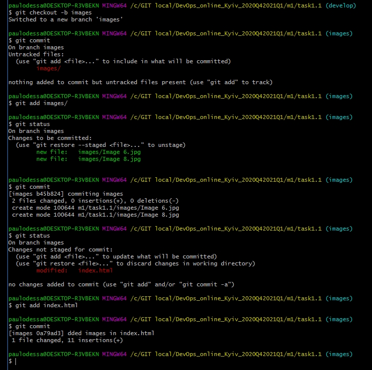
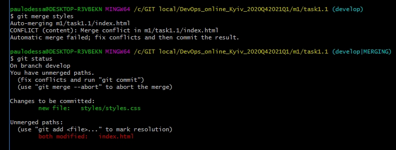
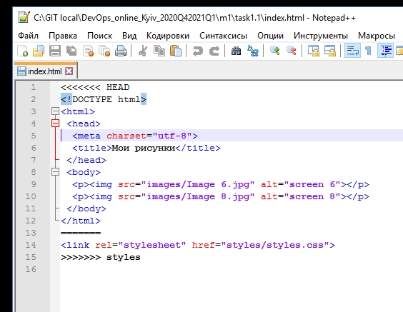
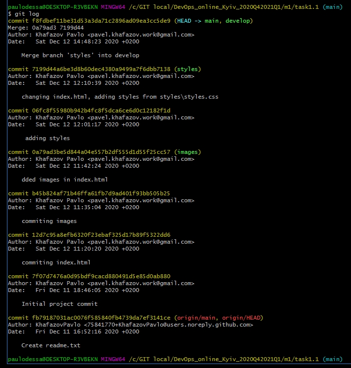

## Task1.1

1. I’ve Installed Git on my workstation from http://git-scm.com/download/win.
2. I’ve set my user name and email address using commands:
```
git config --global user.name "Khafazov Pavlo"
git config --global user.email pavel.khafazov.work@gmail.com
```
   (I’ve used  the --global option, because then Git will always use that information for anything I do on that system.)
   Then I’ve added  a different text editor – Notepad++ (by default it’s Vim):
```
git config --global core.editor "'C:/Program Files/Notepad++/notepad++.exe' -multiInst -notabbar -nosession -noPlugin"
```
   To check my settings I’ve used:
```
git config –list
```


3. I’ve created account on GitHub using name – Khafazov Pavlo and email - pavel.khafazov.work@gmail.com.
4. I’ve created a new private repository on GitHub – DevOps_online_Kyiv_2020Q42021Q1.
5. I’ve created readme.txt file.
6. I’ve cloned repo DevOps_online_Kyiv_2020Q42021Q1 to my workstation on C:\GIT local using command:
```
git clone https://github.com/KhafazovPavlo/DevOps_online_Kyiv_2020Q42021Q1.git
```


7. My repository structure:



8. I’ve made initial commit using commands:
```
git init
git add -A
git commit -m "Initial project commit"
```


9. I’ve created branch “develop” and checkout on it using:
```
git branch develop
git checkout develop
```
10. I’ve created index.html and made commit:
```
touch "C:\GIT local\DevOps_online_Kyiv_2020Q42021Q1\m1\task1.1\index.html"
git add index.html
git commit
```
11. I’ve created branch “images” and checkout on it:
```
git checkout -b images
```
	Then I’ve added images folder with 2 images in it and commited:
```
git add images/
git commit
```
12. I’ve changed index.html by adding 2 images inside it and commited:
```
git add index.html
git commit
```


13.	Then I went back to “develop” branch, created branch “styles”, checkedout on it, added styles folder with styles.css inside it and commited:
```
git checkout develop
git checkout -b styles
git add styles/
git commit -m " adding styles "
```
14.	I’ve changed index.html and commited:
```
git add index.html
git commit
```
15.	Then I’ve switched to “develop” branch and merged “images” into “develop”:
```
git checkout develop
git merge images
```	
	Next I’ve merged “styles” into “develop” and got merge conflict in m1/task1.1/index.html.
	


	I’ve resolved it by editing index.html.
	

	
	And then merging was successful:
```
git add index.html
git commit
git merge styles
```
16.	Next I’ve merged “develop” into “main”:
```
git checkout main
git merge develop
```
17.	I’ve inspected my repository using:
```
git log
```


18.	Then I’ve pushed all changes to origin:
```
git push origin –all
```
19.	I’ve copied result of “git reflog” command into D:\task1.1_GIT.txt.
20.	Then added task1.1_GIT.txt to local repo and then pushed into GitHub repo:
```
git add task1.1_GIT.txt
git commit
git push origin –all
```
## What is DevOps
DevOps is an approach to building and delivering computer software in which everyone works together. This term is a combination of two – “Development” and “Operations”.  DevOps allows for faster delivery to production by implementing and leveraging automated processes. The idea is to design and build all the parts up front, in a way that allows all the pieces to fit together

	


  
   
