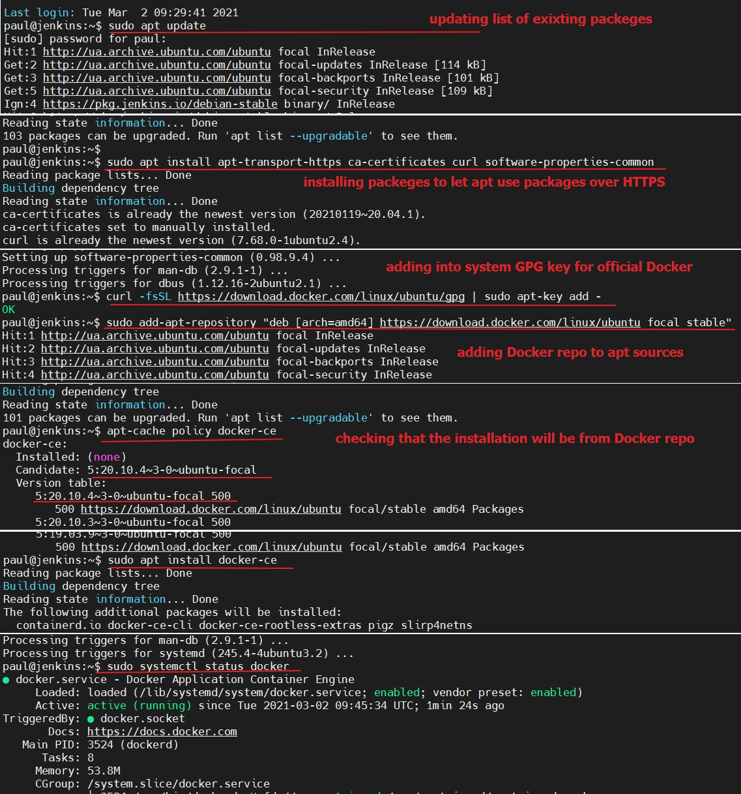

## Task 11.1

## Installing Docker

To enter Docker commands without sudo (by adding username in docker group)

## Creating a directory called flask-app with the following files

## Building the image

## Running container

## Result

## Pushing image to DockerHub

