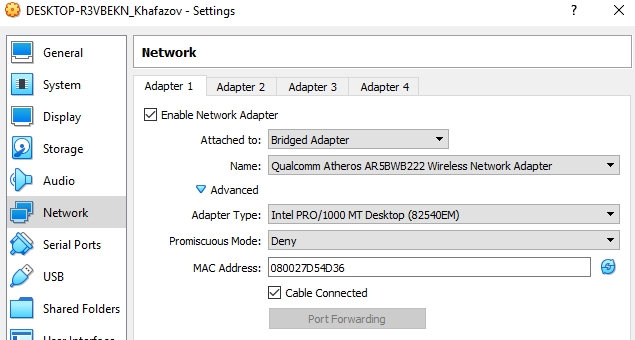
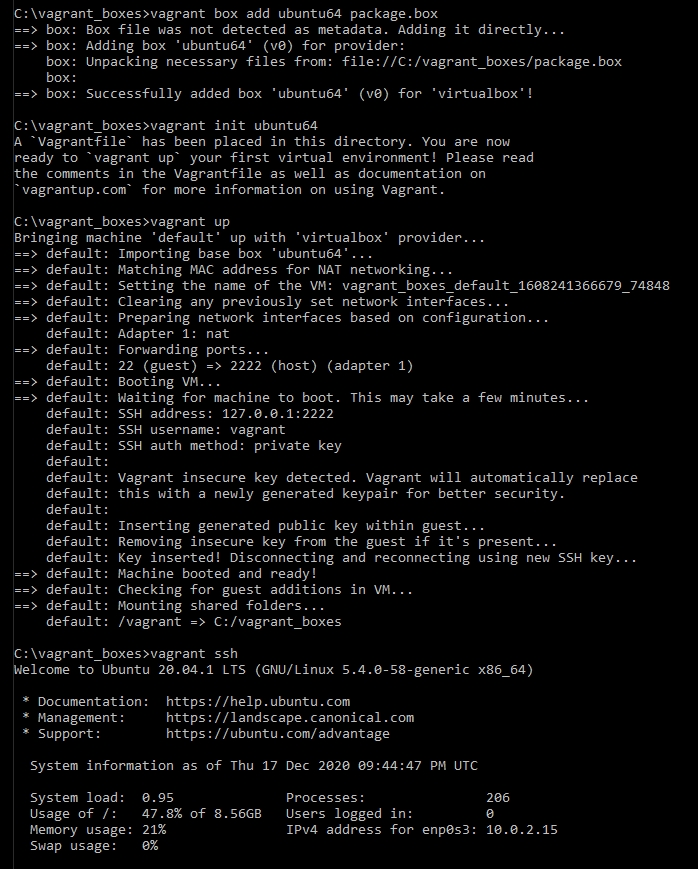

# Task2.1

## Hypervisors

The most popular hypervisors for infrastructure virtualization are Citrix XenServer, Microsoft Hyper-V, Red Hat KVM, and VMware vSphere. They are the biggest players in the server virtualization market.

Microsoft Hyper-V helps in expanding or establishing a private cloud environment. It promotes effective hardware utilization, improves business continuity, as well as makes development and test more efficient.

KVM (Kernel-based Virtual Machine), a part of Red Hat Virtualization Suite, is a complete virtualization infrastructure solution. KVM turns Linux kernel into a hypervisor. It was merged into the Linux kernel mainline in kernel version 2.6.20.

vSphere, the server virtualization platform of VMware, is a set of products that not only includes virtualization, but also management and interface layers. It provides a number of key components including infrastructure services (vCompute, vStorage, and vNetwork), application services, vCenter Server, vSphere Client, etc.

Based on Xen Project Hypervisor, XenServer is an open-sourced bare-metal server virtualization platform. It consists of enterprise-grade features that help enterprises to easily handle workloads, combined OS, and networking configurations. XenServer provides improved virtualized graphics with NIVIDA and Intel and allows execution of multiple computer operating systems on same computer hardware.

### Comparison vSphere vs XenServer vs Hyper-V vs KVM

Feature        |Windows Hyper-V  |vSphere 6.7 |XenServer 7.6 |KVM   |
---------------|-----------------|------------|--------------|------|
RAM (Host)     |24 TB            |12 TB       |5 TB          |12 TB |
RAM (VM)       |12 TB for gen. 2 |6 TB        |1.5 TB        |6 TB  |
CPUs/VM        |240 for gen. 2   |128         |32            |240   |
VM Disk        |64 TB for VHDX   |62 TB       |2 TB          |10 TB |
VM Live Migr.  |Yes              |Yes         |Yes           |Yes   |
VM Repl. sup.  |Yes              |Yes         |Yes           |Yes   |
Overcommit res.|No               |Yes         |No            |Yes   |

## Work with VirtualBox

### Created VM1 - DESKTOP-R3VBEKN_Khafazov, made a clone of it and created a group of this two VMs:


### Made a branched tree of snapshots:


### Exported VM1, saved the DESKTOP-R3VBEKN_Khafazov.ova file to disk and imported VM from .ova file:


### Configured the usb to connect the usb ports of the host machine to the VM and connected USB-HDD “Elemets”:


### Configured a shared folder and added user paul to group vboxsf to get access to SHARED_FOLDER:


### Configured different network modes for VM1, VM2 and checked the connection between them, Host, Internet for different network modes using command ping:

Ping              |    VM1 to VM2    | VM1/VM2 to Internet | Host to VM1/VM2 | VM1/VM2 to Host |
------------------|------------------|---------------------|-----------------|-----------------|
Bridged Adapter   |         +        |           +         |        +        |        +*       |
NAT               |         -        |           +         |        -        |        +        |
Internal Network  |         +        |           -         |        -        |        -        |
Host-only Adapter |         +        |           -         |        +        |        +**      |

(*) _I’ve got a **connectivity** problem when using command ping:_


_But I could ping VM1 and VM2 from Host:_
	


_And I could connect using SSH to VMs:_
	


_The problem was caused by Windows Firewall and I’ve solved it by adding a **rule for ICMPv4 echo-requests**:_
	


(**) _Using VirtualBox Host-Only Network IP_

### The basic commands of VBoxManage

To **list** all the **registered** VMs:```vboxmanage list vms```

To **list** all the **running** VMs:```vboxmanage list runningvms```

To **view** the information about a VM:```vboxmanage showvminfo VM_name```


To **start** a VM:```vboxmanage startvm VM_name [--type headless |-- type gui]```

To **shutdown**:```vboxmanage controlvm VM_name poweroff``` or ```vboxmanage controlvm VM_name acpipowerbutton``` 

To **restart**:```vboxmanage controlvm VM_name reset```

To **save state**:```vboxmanage controlvm VM_name savestate```

To **pause/resume**:```vboxmanage controlvm VM_name [pause |resume]```


To **take snapshot** and **revert back** to a particular snapshot:

```VBoxManage snapshot VM_name take name_of_snapshot```

```VBoxManage snapshot VM_name restore name_of_snapshot```


To **create** VM:```vboxmanage createvm --name "VM_name" --ostype "OS_type" --default --register```

Created VM Ubuntu_test with **parameters**: **RAM** 1024, **VRAM** 128, **CPUs** 2, **network settings** NAT, **HDD** SATA 10GB.


Cloned VM:


## Work with Vagrant

Created a folder Paul_Khafazov, initialized the environment with the Vagrant box - hashicorp/precise64, ran Vagrant up, connected to the VM using PuTTY,recorded the date and time using ```date```, stope and deleted the created VM:


### Creating my Vagrant Box
Created a new Virtual Machine and added the port-forwarding rule: _[Name: SSH, Protocol: TCP, Host IP: blank, Host Port: 2222, Guest IP: blank, Guest Port: 22]_


Installed The Operating System (ubuntu-20.04.1-live-server)
Set root password (vagrant):```sudo passwd root```
Set the super user (the vagrant user) so it’s able to use sudo without being prompted for a password by adding it to the sudoers:```sudo visudo -f /etc/sudoers.d/vagrant```,adding user: vagrant ALL=(ALL) NOPASSWD:ALL
Updated the OS and reboot:
```
sudo apt-get update -y
sudo apt-get upgrade -y
sudo shutdown -r now
```

Installed the Vagrant Key:


Installed and configured OpenSSH Server:```sudo apt-get install -y openssh-server```
Edited the /etc/ssh/sshd_config file:```sudo nano /etc/ssh/sshd_config```, adding: AuthorizedKeysFile %h/.ssh/authorized_keys)
Then restarted ssh:````sudo service ssh restart```
Installed Guest Tools:
```
sudo apt-get install -y gcc build-essential linux-headers-server
sudo mount /dev/cdrom /mnt 
cd /mnt
sudo ./VBoxLinuxAdditions.run
```
Fixed fragmentation issues with the underlying disk, which allows it to compress much more efficiently later:
```
sudo dd if=/dev/zero of=/EMPTY bs=1M
sudo rm -f /EMPTY
```
Packaged the Box:


Result:



### Created a test environment from a server and client (with Nagios)

Installed hostmanager plugin (allows a dynamic edit of host file on host and guest machines, to skip hardcoding IPs into our configuration and to work with hostnames instead of IPs, to refer to server as nagios-server instead of its IP):
```
vagrant plugin install vagrant-hostmanager
vagrant plugin list
```


_To make hogmaster plugin work I had to add C:\Program Files\Oracle\VirtualBox into Path Variable:_


Initialized the environment and checked for status:


### Creating Vagrant-box file using Packer

Made my own box-file of Ubuntu-20.04-amd64(mini) with configurations: **RAM**: 1024 MB, **CPUs**: 2, **VRAM**: 16 MB, **Audio**: none, **Network Adapter**: IntelPRO/1000MT, **HDD**: 10 GB.


[ubuntu.json](ubuntu.json)


  
   
