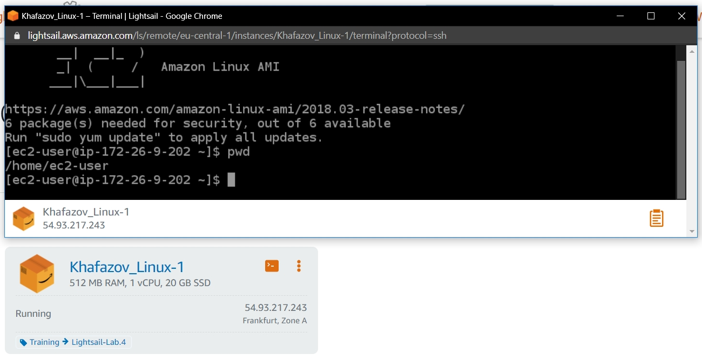

# Task2.2

Created VM with **Amazon Lightsail** and connected to it:



Launched Linux VM (t2.micro) with **EC2**, created snapshot, created and attached Disk_D (EBS) 10 GB:


Loged to **EC2** instance, viewed list of available disks using ```lsblk```, checked if the volume has any data using ```sudo file -s /dev/xvdf```, formatted the volume to ext4 using ```sudo mkfs -t ext4 /dev/xvdf```, created dir “Disk_D”, mounted the volume to this dir using ```sudo mount /dev/xvdf /Disk_D/```, checked the disk space ```df -h .```, made 3 files “test-1, test-2, test-3”`:


To enable automount made entry in “/etc/fstab”:


Launched another instance from snapshot, detached Disk_D and attached to the new instance:


Launched and configured Amazon **Lightsail WordPress** instance:


Stored, retrieved a file using Amazon **S3 bucket**:


Created **S3 bucket**, added file from local dir, downloaded from bucket to local, deleted bucket using **CLI** (to do this I created IAM user - AWS_Admin):


Created a cluster on Amazon **ECS** and ran the online application:


Created **a static website on Amazon S3** (publicly available):
http://khafazov-bucket.s3-website.eu-central-1.amazonaws.com


  
   
