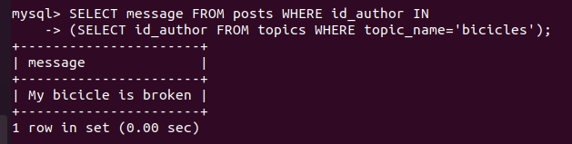
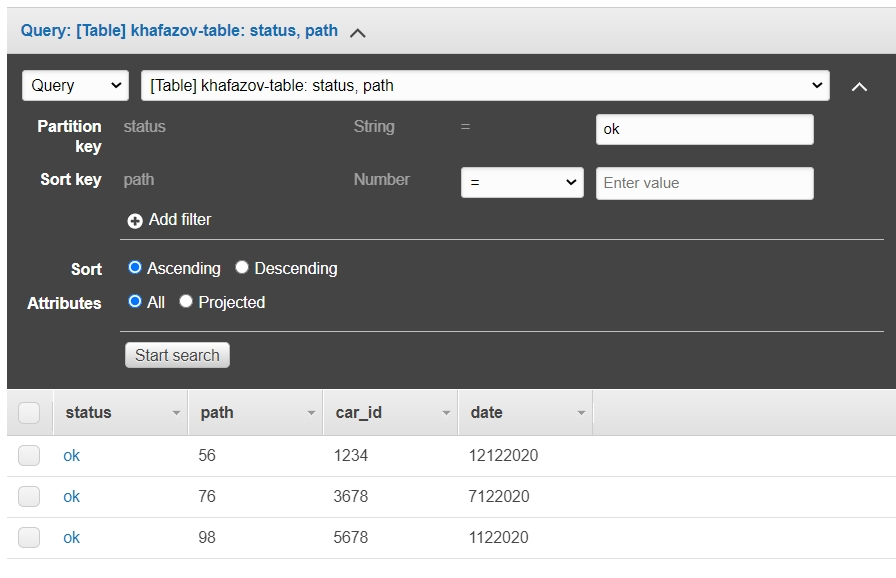

## Task3.1

### Descrption of **the database for the forum**:

There are registred **users** who create **topics** and **post** messages in these topics. This means that the database forum should consist of 3 tables: **users**, **topics**, **posts**.
 

A **primary key** uniquely identifies each record in a table.
A **foreign key** is used to link tables together.
A **not null** means the column can not accept null values.
An **auto increment** allows a unique number to be generated automatically for new record.
**int** is a numeric data type.
**text** is a string data type.
**varchar** is a variable lenght string.

### Creating database and tables:

### Filling in tables:

### Constructing and executing operator SELECT:

	

_When I was filling the table **topics** I've added several authors (id-authors) to one topic (topic-name), because of this one topic had several id-topic and authors. I've corrected this:_

The following statement selects who created topic "bicicles":

The following statement selects which messages "bicicles" topic author wrote:

The following statement selects in which topics the author of the topic "about fishing" left messages:

The following statement selects from tables topics and users, and joins the result:

 all posts, what topics they relate to and the authors of these posts:

The following statement selects all users and topics created by them (if the user has not created a topic, then - NULL):

The following statement selects only those groups with more than two messages:

### Other different SQL queries (DDL, DML, DCL):

### Creating new user with different privileges:

_I had a issue with a validate_password plugin, to resolve this issue I've changed policy to low and special char count to 0._

Granting a newuser with different privileges:

### Making backup of DB forum, deleting table posts, and restoring from backup:

### Transfering local database to RDS AWS:

Creating RDS database and aditing inbound rules to allow public access:

Connecting to RDS AWS:

 
 
 
 
 Snapshot:
 
 
 
 ### Working with DynamoDB (creating table, entering data, using query and scan):
 

  

