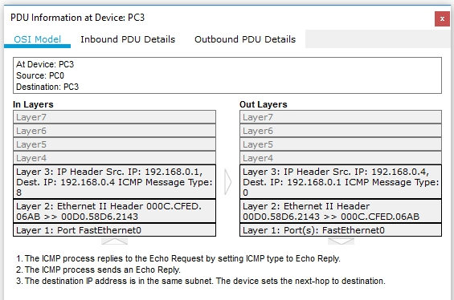

## Task4.1

Topology 1:

ICMP is a network-layer protocol. It is a controlprotocol that is considered to be an integral part of IP, althoughit is architecturally layered upon IP - it uses IP to carry its data end-to-end. ICMP is an integral part of IP and must be implemented by every IP module. That's why in this case it's not working: 

Topology 2:

When I tried to send several ICMP requests to several devices I've got a domain collision (because of using hubs) :

Topology 3:

This network (unlike the topology 1 network) uses switch. Switch manages the flow of data across a network by transmitting a received network packet only to the one or more devices for which the packet is intended. Switch  uses MAC addresses. A switch is more intelligent than a hub, which simply retransmits packets out of every port of the hub except the port on which the packet was received, unable to distinguish different recipients, and achieving an overall lower network efficiency.

Topology 4:

Topology 5:

A router (topology 5) and a switch (topology 4) are both network connecting devices, but difference is that the router works at network layer and is responsibe to find the shortest path for a packet whereas switch connects various devices in a network. A router connects devices across multiple networks. As a switch connects multiple devices to create a network, a router connects multiple switches, and their respective networks, to form an even larger network. A router works in network layer and a switc hworks in data link layer.  A switch maintains a table of MAC addresses and what physical switch port they are connected to. Switching is the function of moving data packets within the same LAN. A Router knows where to send a packet by using network part of the destination IP address, and maintains a routing table and uses it to determine the route to the destination network.

  
   
