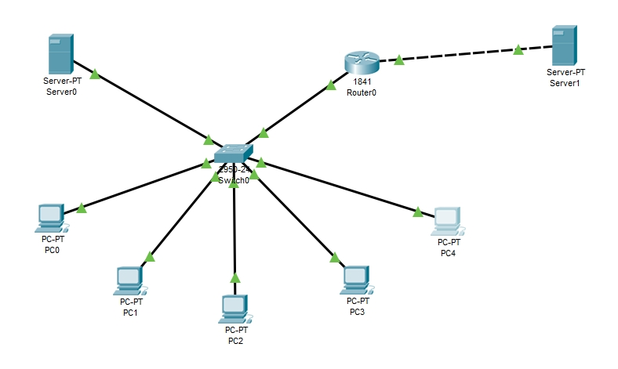
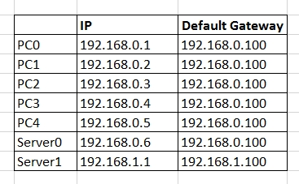
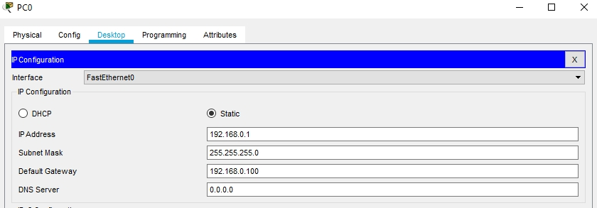
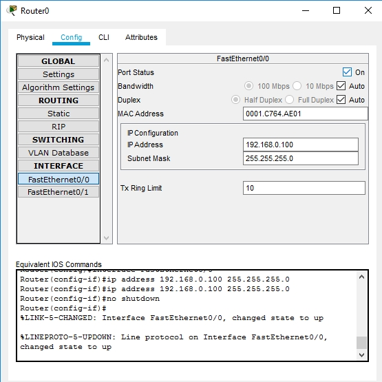
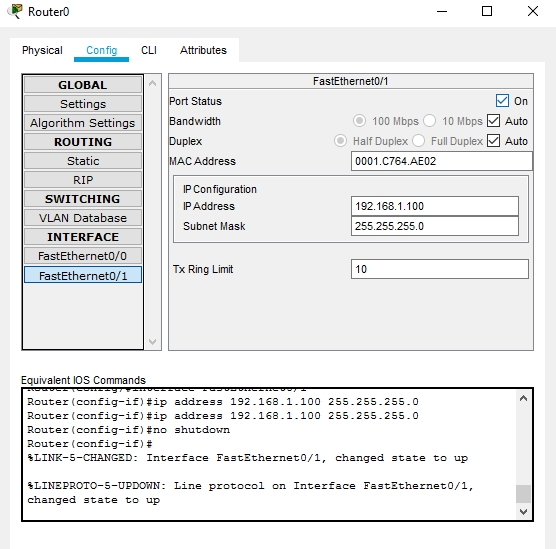
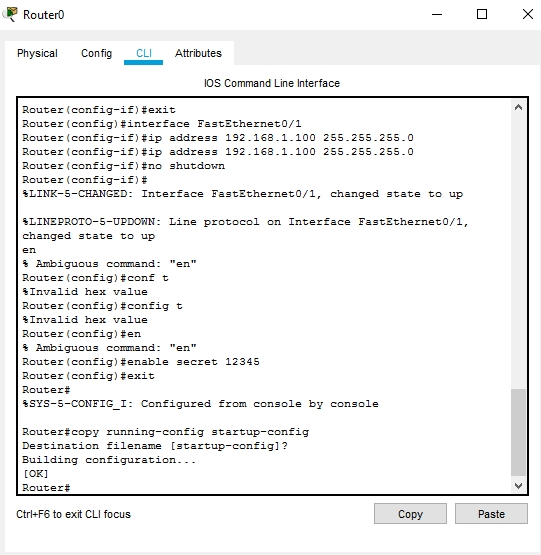
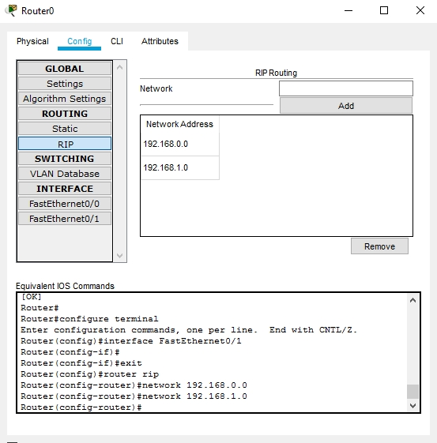
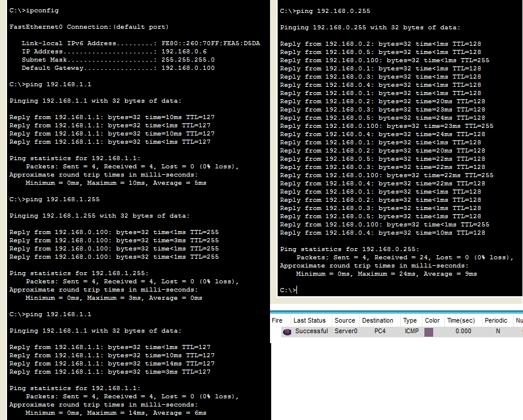

## Task4.3

Topology:

Configuring IPs (for the rest the same way):

Configuring router ports:

Password configuration and RIP routing:

Testing:

### Project: 

[project 4-3-1.pkt](https://github.com/KhafazovPavlo/DevOps_online_Kyiv_2020Q42021Q1/blob/main/m4/task4.3/project%204-3-1.pkt)

   
