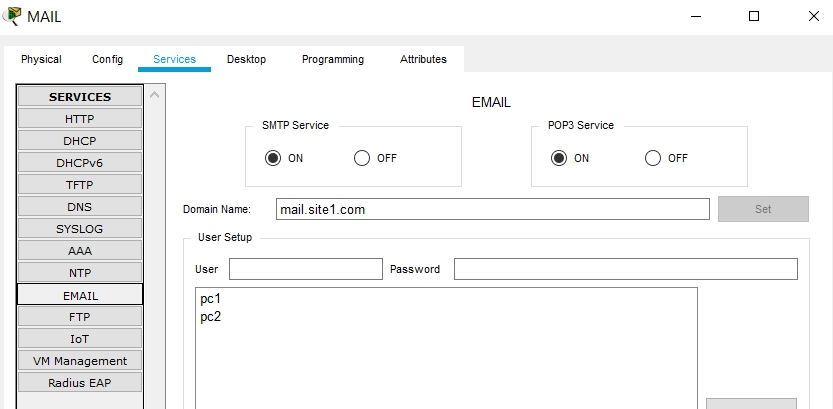

## Task4.4

Topology:

Configuring router 1:

Adding ip pools P1 and P2 on DHCP-server:

IP configuration:

Adding record in DNS-server for HTTP-server site1.com:

Configuring mail clients:

Mail-server:

HTTP-server:

Static routing between networks:

Results:

### Project: 

[project 4-4.pkt](https://github.com/KhafazovPavlo/DevOps_online_Kyiv_2020Q42021Q1/blob/main/m4/task4.4/project%204-4.pkt)

   
