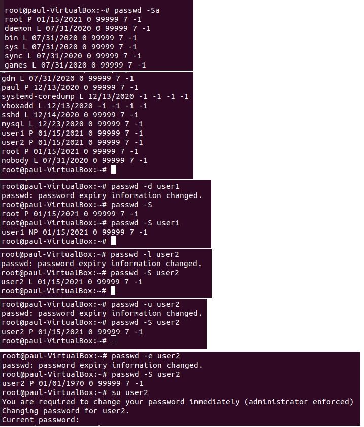
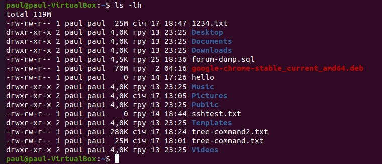

## Task5.1

## Part1

Logged in to the system using `sudo -i` command:

Changed password using `passwd`. Password changing affected to file **etc/shadow** which stores the hashed passwords (in this case is used SHA-512 hash function: **$6$**):

Created a new user (with home directory), in the file **/etc/passwd** for user1 password is 'x', that means the password stored in the file **/etc/shadow**. The '!' in the **/etc/shadow** means that the password is locked. To add password used `passwd user1` command. When we create a new user his home directory is empty, if we want to add files or directories in usser's home directory automatically in the moment of its creation we have to add these files or directories in **etc/skel**. To create a group is used `groupadd`. To view groups `cat /etc/group`. To add user to group `usermod -aG`. 

To display password status info using command `passwd -S`, to remove using `-d` key, to lock and unlock `-l` and `-u`, to force the user to change the password in the next login using key `-e`:

To modify a user's information is used command `chfn` and to view `finger` or `pinky`. This information is stored in /etc/passwd. 

To add info in "Plans" we need to create /home/user/.plan file and some info in it. To view info about user we can use his name entered in 'full name' string.

Using `history` command:

Using `man`and `help`.
To get idle status and login details of a user: `finger -s`. To display user's info and contest of .plan file is used -l key, to prevent displaing .plan file is used -p key. 
To display password info: `passwd -S`, to delete password is used -d key, to expire the passwor is used -e key.

`more` is a command used to display the contents of a file. Similar to `more`, `less` command allows to view the contents of a file and navigate through file. The main difference between more and less is that the less command is faster because it does not load the entire file at once and allows navigation though file using page up/down keys.

The Linux home directory is a directory for a particular user of the system and consists of individual files. This is the first place that occurs after logging into a Linux system. It is automatically created as "/home" for each user in the directory'.

## Part2

Using the `tree` command. 

To determine the file type of a file is used a `file` command:

An absolute path is defined as the specifying the location of a file or directory from the root directory(/). Relative path is defined as path related to the present working directory(pwd).

The `ls` command is used to list files or directories. The `ls -l` command to list the contents of the directory in a table format with columns including: content permissions, number of links to the content, owner of the content, group owner of the content, size of the content in bytes, last modified date / time of the content, file or directory name. Thee `ls -a` command to list files or directories including hidden files or directories. (anything that begins with a . is considered a hidden file). The `ls -la` command to list files or directories in a table format with extra information including hidden files or directories. 

  

Creating dir **lab2-dir**, writing info about dirs in / in the file **info-root-dir.txt**, copying to /home this file using absolute and relative paths, removing dir and files.

Creating a subdirectory **test** in /home dir, copying the .bash_history file to this directory while changing its name to **labwork2**, creating a hard and soft link to the labwork2 file in the test subdir. A symbolic or soft link is an actual link to the original file, whereas a hard link is a mirror copy of the original file. If you delete the original file, the soft link has no value, because it points to a non-existent file. But in the case of hard link, it is entirely opposite. Even if you delete the original file, the hard link will still has the data of the original file. Because hard link acts as a mirror copy of the original file.

Changing the data by opening a symbolic link. The source file displays the same data as a soft lynk.
Renaming the hard link file to hard_lnk-labwork2 and the soft link file to symb_lnk_labwork2,then deleting the labwork2. After that there is no such file or directory called softlink after we removed the original file. So, now we understand that soft link is just a link that points to the original file. 
Both hardlink and source file have the same the inode number. After deleting the source file, we can view contents of the hardlink file.

Using the **locate** utility to find files contain "squid", "traceroute". I didn't find files that contain both words, but found files that contain one of them and counted files which according to tamplate using `-b` and `-c` keys: 

Determing which partitions and devices are mounted in in the file system:

**dev/sda** - mass-storage devices, **dev/sda1,2,5** - numbers of partitions, **dev/loop** - loop devices making plain files accessible as block devices, **tmpfs** - temporary file storage.

Using `grep` command to count the number of lines containing a word "dog" in a file:

Using the find command, find all files in the /etc directory containing the "host" character:

Listing all objects in /etc that contain the "ss" character:

Organizing a screen-by-screen print of the contents of the /etc directory:

The types of devices and how to determine the type of device:

Device files are denoted as the following: c - character; b - block; p - pipe; s - socket.

The way to list block devices such as hard disks is using the command `lsblk`:

The `lshw` command lists the devices connected to your computer:

The `ls` command will show the file type as an encoded symbol found as the first character of the file permission part.
Types of Linux files and that `ls` command identifiers: - regular file; d directory; c character device file; b block device file; s local socket file; p named pipe; l symbolic link.

Listing the first 5 files and dirs that were recently accessed in the /etc directory:

