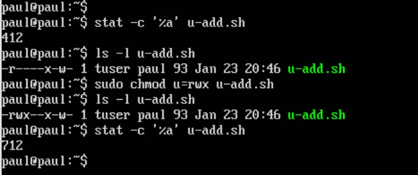

## Task5.2

When a user is created the following information is stored in **/etc/passwd** file (/etc is the dir where host-specific config files are stored):
1. login user id
2. encrypted password ("x" indicating use of /etc/shadow, "*" means account disabled)
3. user ID number (UID)
4. group ID number (GID) (but users can be in more groups too)
5. comments (any text information, often user's full name, office, etc)
6. home dir (absolute path, usually /home/$USER)
7. shell to give the user at login (usually /bin/bash, the list of interpretators in etc/shells)
This file requires root access for modification. Its content can be viewed by anyone. Using priviliged commands users can modify content related to their own account info (passwd, chsh, chfn). Encrypted passwords (hashed) are usually stored in etc/shadow, accessible only by root. 
Groups allow a set of permissions to be assigned to group of users. Every file system object has group permissions, if you are not the owner of the object but are in that group then group permissions apply to you. File system objects have only one owner and can be in only one group. Logged in users can be members of multiple groups. Group information is maintained in etc/group and etc/gshadow (but at login every user is given an initial GID from the passwd file). When a group is created on the system, the following information is stored in **/etc/group**:
1. group name
2. encrypted password ("x" indicating use of /etc/gshadow)
3. group ID number (GID)
4. list of usersids that are members of that group
Modification can be done by root or by the group admin for a group. Can be viewed by anyone. Encrypted passwords (hashed) are stored in /etc/gshadow, accessible by root. 

There are 3 types of users in the Linux operating system: root user, system users, regular users. 
Pseudo-users.Each of the UNIX variants contains pseudo-user description lines in the password file. These descriptions are never edited. Users of these names are not registered in the system and are only needed to confirm ownership of the processes. The most used are: daemon - used by system service processes that need the ability to write files to disk; bin - gives ownership of executables command; adm - owns registration files and allows to read logs from the /var/log directory; nobody - used by many services; sshd  –used by the secure shell server.

A UID (user identifier) is a number assigned by Linux to each user on the system. This number is used to identify the user to the system and to determine which system resources the user can access. UIDs are stored in the /etc/passwd file.  The root user has the UID of 0. Most Linux distributions reserve the first 100 UIDs for system use. New users are assigned UIDs starting from 500 or 1000 (new users in Ubuntu start from 1000).
There are several ways to define UID:

Groups in Linux are defined by GIDs (group IDs). Just like with UIDs, the first 100 GIDs are usually reserved for system use. The GID of 0 corresponds to the root group and the GID of 100 usually represents the users group. GIDs are stored in the /etc/groups file. 
To find out all the groups a user belongs to:

To list all members of a group:

To add a user to the systenm is used `useradd` command with different keys:

To change the name (account name) of an existing user:

The /etc/skel directory contains files and directories that are automatically copied over to a new user’s when it is created from useradd command (to ensure that all the users gets same intial settings and environment). 

The location of /etc/skel can be changed by editing the line that begins with SKEL= in the configuration file /etc/default/useradd. By default this line says SKEL=/etc/skel.

**To delete a user account**: `userdel username`, this command reads the content of the /etc/login.defs file, properties defined in this file override the default behavior of userdel, and if "USERGROUPS_ENAB" is set to "yes" in this file, userdel deletes the group with the same name as the user, only if no other user is a member of this group. The command removes the user entries from the /etc/passwd and /etc/shadow, files. When removing a user account with userdel, the user home and mail spool directories are not removed.
to remove the user’s home directory and mail spool: `userdel -r username`. If the user you want to remove is still logged in, or if there are running processes that belong to this user, the userdel command does not allow to remove the user. In this situation, it is recommended to log out the user and kill all user’s running processes with the command: `sudo killall -u username`. And then you can remove the user.
Another option is to use the -f (--force) option that tells userdel to forcefully remove the user account, even if the user is still logged in or if there are running processes that belong to the user: `userdel -f username`.

**To lock, unlock** and check status of the given user account in Linux using **passwd command**:

**To lock, unlock** and check status of the given user account in Linux using **usermod command**:

**To disable/enable SSH access** to the given user:

**To remove a user's password** and provide him with a password-free login for subsequent password change is used `passwd -d username` command.

To display information about the directory and files in it:

The -l option tells ls to print files in a long listing format. When the long listing format is used, you can see the following file information: the file type; the file permissions; number of hard links to the file; file owner; file group; file size; date and time; file name.
The most important columns of the output. The first character shows the file type:- - regular file; b - block special file; c - character special file; d - directory; l - symbolic link; n - network file; p - FIFO; s - socket. The next nine characters are showing the file permissions. The first three characters are for the user, the next three are for the group, and the last three are for others. The permission character can take the following value: r - permission to read the file; w - permission to write to the file; x - permission to execute the file; s - setgid bit; t - sticky bit. On a Linux system, each file and directory is assigned access rights for the owner of the file, the members of a group of related users, and everybody else. Rights can be assigned to read a file, to write a file, and to execute a file. ( -rwxrwxrwx means regular file with read, write, execute permissions for the file owner, the group of owner and all othwer users. Value in numbers 777	(rwxrwxrwx) and that means no restrictions on permissions, anybody may do anything, it's not a desirable setting.)

The relationship between the file and the user whos tarted the process is determined as following: if the UID of the file is the same as the UID of the process,the user is the ownerof the file; if the GID of the file matches the GID of any group the user belongs to,he is a member of the group to which the file belongs; if neither the UID nor the GID of a file overlaps with the UID of the process and the list of groups that the user running it belongs to,that user is an outsider.
 
 **To change file ownership** using `chown`:
 

**To change permissions** using `chmod`:

**To represent permissions is an octal** (base-8) notation using `stat -c %a`:

On Linux systems, the default creation permissions are 666 for files, which gives read and write permission to user, group, and others, and to 777 for directories, which means read, write and execute permission to user, group, and others. Linux does not allow a file to be created with execute permissions.
The default creation permissions can be modified using the `umask` command.
It affects only the current shell environment. On most Linux distributions the default system-wide umask value is set in the pam_umask.so or /etc/profile file.
If you want to specify a different value on per-user basis edit the user’s shell configuration files such as ~/.bashrc or ~/.zshrc. You can also change the current session umask value by running umask followed by the desired value.
To view the current mask value: `umask`
The output will include the: 022 - for root; 0002 - for regular user.
The umask value contains the permission bits that will not be set on the newly created files and directories. The default creation permissions for files are 666 and for directories 777. To calculate the permission bits of the new files subtract the umask value from the default value. To calculate how umask 022 will affect newly created files and directories: files: 666 - 022 = 644 (the owner can read and modify the files, group and others can only read the files). Directories: 777 - 022 = 755 (the owner can cd into the directory and list read, modify, create or delete the files in the directory, group and others can cd into the directory and list and read the files).
To display the mask value in symbolic notation using the -S option: `umask -S`.

**Sticky Bit** is mainly used on folders in order to avoid deletion of a folder and it’s content by other users though they having write permissions on the folder contents. If Sticky bit is enabled on a folder, the folder contents are deleted by only owner who created them and the root user. No one else can delete other users data in this folder(where sticky bit is set). This is a security measure to avoid deletion of critical folders and their content(sub-folders and files), though other users have full permissions. 
Sticky Bit can be set in two ways: Symbolic way (t,represents sticky bit) and numerical/octal way (1, Sticky Bit bit as value 1).

The script file should have attribute - executable, otherwise, trying to run it, you will encounter a "Permission denied error". It can be done using: `chmod +x ./scriptfile`

