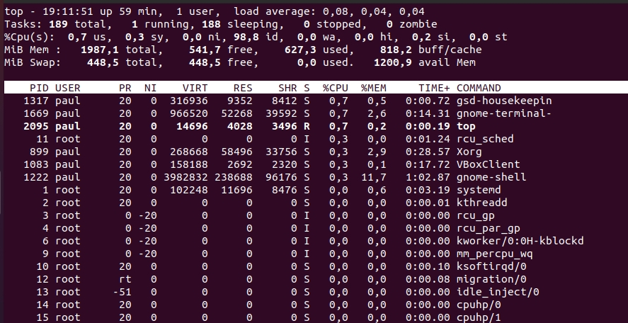
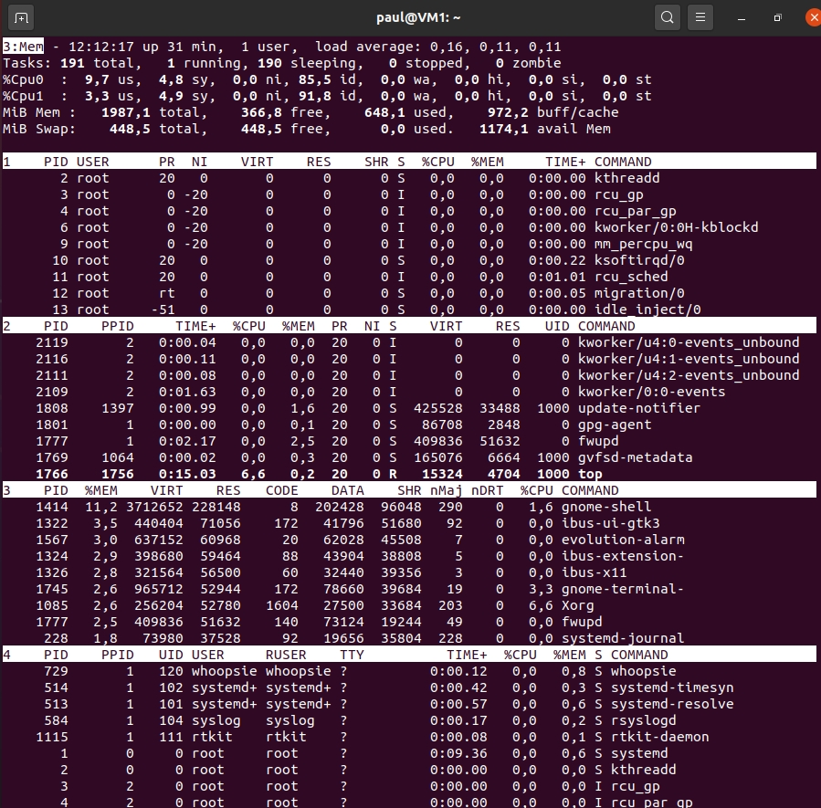
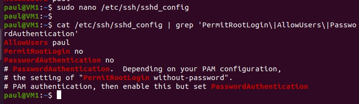
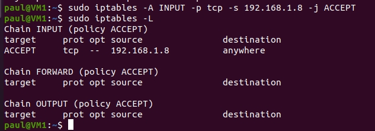
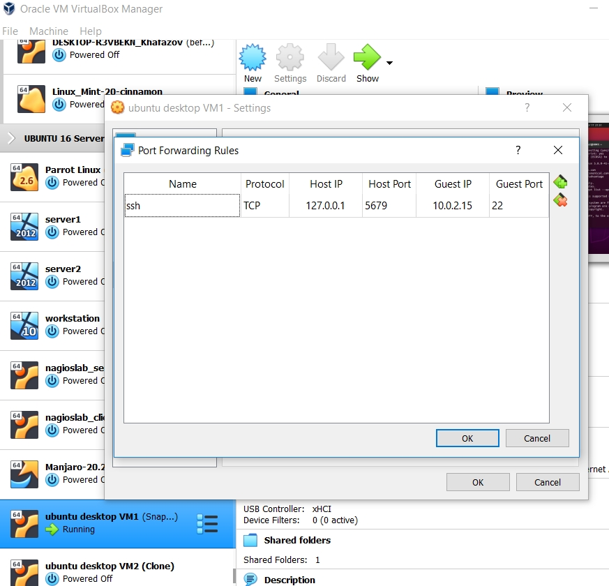

## Task5.3

## Part 1

## 1. 

**A process in Linux** can broadly be in 4 states: running, sleeping, stopped, zombie. From its spawn till kill/terminate or exit the process has a life cycle going through these several states. Some processes exist in process table even after they are killed/died, those processes are called zombie processes. 
We can use `top` to list total count of all these states.

## 2.

`pstree` command shows the running processes as a tree which is a more convenient way to display the processes hierarchy.
To find ancestor chain of a process:

To highlight the specified process and its ancestors is used `pstree -H`:

* _but in case of using Parrot Linux (my case) it's not working good. In Ubuntu it works:_

## 3.

**Procfs** (proc filesystem) is a special filesystem that presents information about processes and other system information in a hierarchical file-like structure. Typically, it is mapped to a mount point named /proc at boot time. It can be used to obtain information about the system and to change certain parameters at runtime. It contains many files and subdirs, some ofthem are: **/process_id** - dir with info about this process; **/devices** - list of device drivers configured into the currently running kernel; **/mounts** - mounted file systems; **/sys** - contains editable system information; **/cpuinfo** - information about CPU.

## 4.

There are several ways to display information about CPU, some of them are to use `cat /proc/cpuinfo` and `lscpu`:

## 5.

Using the `ps` command to get information about the process by its ID (owner, arguments, effective group ID, name of control groups, process ID, effective user name,command name):

## 6.

The Linux **kernel processes** are started by the kernel itself, and the **kthread** process is assigned as the parent process which has spawned them (with с PID=2). Thus, the processes of the kernel must be considered the process itself with PID = 2, as well as processes whose PPID (i.e. the PID of the parent) is 2. 
To display kernel processes `sudo ps --ppid=2 --pid=2`

`pstree` without parameters shows only the tree of processes spawned by init (user processes). Kernel processes will show `pstree 2`.

User processes are all others:

## 7.

Displaying all processes in BSD format:

`ps` STAT output such processes state codes:
* D Uninterruptible sleep (usually IO)
* R Running or runnable (on run queue)
* S Interruptible sleep (waiting for an event to complete)
* T Stopped, either by a job control signal or because it is being traced.
* X dead (should never be seen)
* Z Defunct ("zombie") process, terminated but not reaped by its parent.
* < high-priority (not nice to other users)
* N low-priority (nice to other users)
* L has pages locked into memory (for real-time and custom IO)
* s is a session leader
* l is multi-threaded (using CLONE_THREAD, like NPTL pthreads do)
* + is in the foreground process group 

## 8.

To display only the processes of a specific user (by effective user's ID (EUID) or name) is used -u flag for command ps:

_-f flag is used to performe a full-format list._

## 9.

The output from `ps` is a snapshot view. It doesn’t update. To get an updating view of the processes, is used the `top` command. It provides a dynamic view of the processes running in OS. 

## 10.

The display is in two parts. There is a **dashboard area** at the top of the screen made up of lines of text, and a table in the lower part of the screen made up of columns. **The first row** of the dashboard indicates: current time, uptime of the machine (up), users sessions logged in (users), average load on the system (load average). **The second row** indicates: total processes count, running, sleeping, stoped and zombie (processes waiting to be stopped from the parent process, that has completed execution, but still has an entry in the process table and his entry still need to allow the parent process to read its child exit status.). **The third row** shows how the CPU is used (if to sum up all % the total will be 100% of CPU usage). It consists of: user processes of CPU (us), system processes of CPU (sy), priority upgrade nice of CPU (ni), percentage of CPU wich is not used (id), processes waiting for I/O operations of CPU (wa), serving hardware interrupts of CPU (hi), serving software interrupts (si), the amount of CPU ‘stolen’ from this virtual machine by the hypervisor for other tasks (such as running another virtual machine) this will be 0 on desktop and server without virtual machine (st). **Fourth and fifth rows** show the information about the memory usage (RAM and Swap): in use, free, buffers and cached. And **the table** has such columns: PID (process ID), USER (that is the owner of the process), PR (priority of the process), NI (nice value of the process), VIRT (virtual memory used by the process), RES (physical memory used from the process), SHR (shared memory of the process), S (indicates the status of the process), %CPU (the percentage of CPU used by this process), %MEM (the percentage of RAM used by the process), TIME+ (the total time of activity of this process), COMMAND (the name of the process).

## 11.

To list all processes running uder a specific user is used the key `-u` along with the `top` command:

We can specify user not only by his name but by his UID too:

## 12.

Interactive commands for the top command (capital letter means Shift+letter):

* h - help (to view for ineractive commands and info about several parameters);

* q - to quit from top;

* z - color/monochrome toggle (witches the `current’ window between your last used color scheme and the older form of black-on-white or white-on-black);

* c - will display absolute path of running process;

* d - will change screen refresh interval (by default is 3.0 seconds);

* L - will locate the string;

* u - will filter processes by the owner’s username;

* i - toggles whether idle processes will be displayed;

* H - will show a list of threads instead of processes;

* k - will kill a process;

* W - to write a configuration file (it will output the location of the file);

* M - sort by memory utilization;

* P - sort by CPU utilization;

* x - changes highlighting for the current sort field;

* A - multi screen mode (4 tables);

* g - to switch between screens;

* V - will switch to the forest view;

* t and m - will change the default look of the CPU and memory statistics.

## 13.

Sort the contents of the processes window using various parameters:

* `top -o +%CPU` - to start with sorting by CPU (from high to low);

* `top -o -%CPU` - CPU sorting fromlow to high;

Another is to use interactive command P in top:

In a situation when you need to use top’s filtering to focus on a few processes: o - to activate this mode. A prompt appears inside top, and you can type a filter expression here.
To filter processes which have a CPU utilization of more than 2% is used "%CPU>2.0".

## 14.

Linux use a priority system with 40 priorities, ranging from -20 (highest priority) to 19 (lowest priority). Processes started by regular users usually have priority 0. The `ps` command can display the priority (nice, or NI, level, for example) using the -l option. The `nice` command displays our default priority. The nice command can also be used to start a process with a different priority (the -n  option with a positive value to increase the priority value and a negative value to decrease it). Processes with the lowest priority value run at highest scheduling priority. If you need to change priority of started process, the way to change it after it has started is to use the `renice` command.

## 15.

Changing the priority of the process "dd" using the top command: using ineractive key "r", entering PID of the process you want to change the process value, and entering renice value (from -20 to +19):

## 16.

A normal user can kill his own processes, but not those that belong to other users. Both `top` and `ps` show the user under which a process is running. In the case of top, the second column contains the username. With `ps aux`, the first column contains the username. A root user can kill all processes (add sudo before any command to run it as root).
In Linux, when a process is killed, a “terminating signal” is delivered to the process. Although there are many different types of signals, we mostly deal with the “SIGTERM” and “SIGKILL” signals. They have a numeric value of 15 and 9 respectively. By default, all the process killing commands use “SIGTERM”, which allows the program to run some code before it exits, thus allowing it to terminate “gracefully”. If you want to terminate the process forcibly, you can use “SIGKILL” instead. The Linux kernel maintains some information related to the state of a process. When a process terminates, the kernel must keep the information around, so that the parent process can find out if the child process was able to complete its tasks and whether it terminated on its own, or it was killed. Until the parent has done so, these “zombie” processes will appear in the list of processes. You can’t kill such a process because it’s just an entry in the list of all processes, and it doesn’t have an actual process associated with it. When a process performs input/output operations (such as reading from or writing to disks), it is said to be in a state of “uninterruptible sleep”. You can’t kill a process while it is in this state. You can tell if a process is in the “zombie”(Z) or “uninterruptible sleep”(D) state by looking at the 8th column of the top/ps output. There are various commands you can use to kill a process — `kill`, `killall`, `pkill` and `top` + k command.

Using `top`:

Using `killall` to terminate several processes (-y  to kill a process that has been running for less than number of minutes, -o  for more than number minutes):

Using `pkill` (allows you to kill processes based on partial matches) and `kill` commands:

## 17.

There are fundamentally 2 types of processes in Linux: **foreground** (interactive processes, initialized and controlled through the terminal session) and **backgroung** (non-interactive processes, not connected to a terminal). 
Commands: `fg` (foreground) is used to put a background job in foreground, `bg` is used to place foreground jobs in background, `job` displays status of jobs in the current shell session, `nohup` (no hang up) allows to run command/process or shell script that can continue running in the background after you log out from a shell, `yes` outputs a string repeatedly until killed (if string is not specified, the word it repeats is "y"), `sleep` is used to delay for a fixed amount of time during the execution of any script.

## Part 2

## 1.

Connection via OpenSSH from Windows host machine to Ubuntu VM1:

 
Editing ssh config file to make alias myVM1 to avoid of typing "paul@192.168.1.9" (username and ip):

Using `ssh-keygen` to create a key pair (public and private):

Trying to use the `ssh-copy-id` command to copy an SSH public key generated by the ssh-keygen command to a remote Linux device for passwordless login:

Unfortunately, Windows 10’s implementation of the OpenSSH client does not have the ssh-copy-id command available. However, a PowerShell one-line command can mimic the ssh-copy-id command:

_I had some trouble becase there wasn't such a directory as .ssh, so in this command I had at first create it._

Copying file from Windows host to Ubuntu VM1 using `scp` command:

## 2.

SSH settings to increase the security:

* Configure SSH to log in with SSH keys instead Of a password. Using passwords for SSH authentication is insecure. If one of users sets a weak password, server can be compromised. To avoid this, is used SSH key for authentication without a password. (implemented in paragraph 1).

* Secure the SSH configuration file. (change the default security options by editing /etc/ssh/sshd_config).

Change the default SSH port (by default most servers listen for SSH connections on port 22). To change default port from 22 to 8908, edited the following line: Port 8908.

Disable server SSH root Login, it is important to add the user account we use to log in, we are using SSH keys for SSH authentication, and can disable the server password.

* Set firewall rules to restrict the incoming SSH traffic for everyone but one IP address.

## 3.

`ssh-keygen -t type`, where type is either of dsa,rsa and ecdsa. In practice, a RSA key will work everywhere. ECDSA support is newer, so some old client or server may have trouble with ECDSA keys. A DSA key used to work everywhere, as per the SSH standard (RFC 4251 and subsequent), but this changed - OpenSSH 7.0 and higher no longer accept DSA keys by default.
ECDSA is computationally lighter, but you'll need a really small client or server (say 50 MHz embedded ARM processor) to notice the difference. Right now, there is no security-related reason to prefer one type over any other, assuming large enough keys (2048 bits for RSA or DSA, 256 bits for ECDSA); key size is specified with the `-b` parameter. However, some ssh-keygen versions may reject DSA keys of size other than 1024 bits, which is currently unbroken, but arguably not as robust as could be wished for. To sum this up, `ssh-keygen -t rsa -b 2048` will be good desicion.

The 4096 key is more secure but also comes with an overhead in CPU time on both server and client to encrypt and decrypt with the bigger key. To learn about the extra time used with larger key sizes, we can use the `openssl` command. This has an inbuilt speed test, so we can test the speed of using 1024, 2048 and 4096 bit keys. 

_From the output: on a 2048 bit key we can sign 1,031 requests per second but only 161 with a 4096 bit key._

To create key with more modern algorithm (ed25519 - Edwards Twisted Curve algorithm, 256 bit ), encrypt this key multiple times ( in our case 250), add a comment to help identify the key’s purpose. If we want to check the key size and the comment then we can use  ssh-keygen with  -l -f options. 

## 4.

Port forwarding for the SSH client from the host machine to the guest Linux virtual machine behind NAT.

