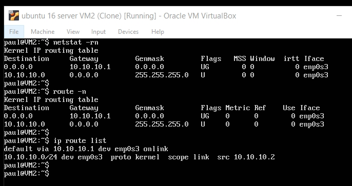
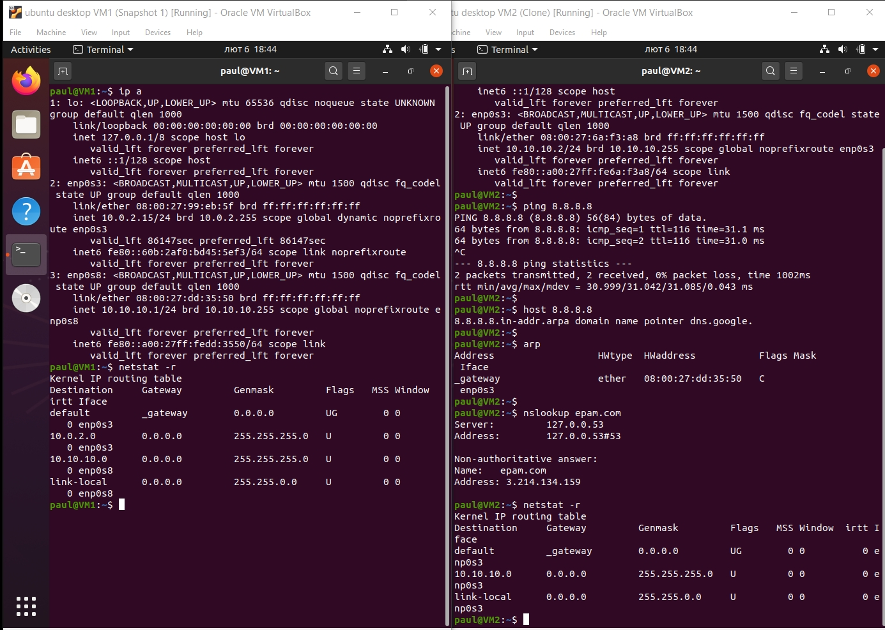

## Task6.1

## Creating connection between virtual machines VM1 and VM2 on Ubuntu 16.04 Server

VM1 has 2 network interfaces (NAT, Internal), VM2 has Internal network interface. VM2 will have access to the Internet using VM1 Internal interface as a gateway.

Configuring VM2 ( changing hostname, configuring the network):

Editing /etc/network/interfaces to add static ip, mask, gateway

I had difficulties with restarting netwoks service using `service restart networking`, so I've used `sudo /etc/init.d/networking restart`.

Configuring VM1

  
 _After I had connectivity troubles because I didn't remove '#' before this string net.ipv4.ip_forward=1 in /etc/sysctl.conf file. So I fixed this._
 
 Checking the access to the Internet from VM2:
 

 
 I 've used `nslookup` determine which resource has an IP address 8.8.8.8:
 

 
 To determine IP belongs to epam.com we can use `ping` or `nslookup`:
 
 

_To be able to do this we have to add dns-nameserver in /etc/network/interfaces file.

To display routing table:

To trace the route is used `tracerout`. By default traceroute uses UDP packets and sometimes it's not working correctly (because of routers and firewalls), so -I key is used to send ICMP:

_Host default gateway is 192.168.1.1 (my TP-Link router)._ 

## Creating connection between virtual machines VM1 and VM2 on Ubuntu 20.04

In this case to configure network setting was used netplan and changed /etc/netplan/01-network-manager-all.yaml file.
To restart network service was used `service network-manager restart`, iptables configuration was saved by using `iptables-save > /etc/iptables/rules.v4`, iptable configs were the same.

   

