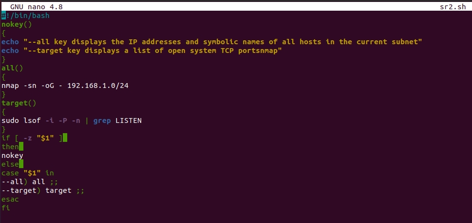
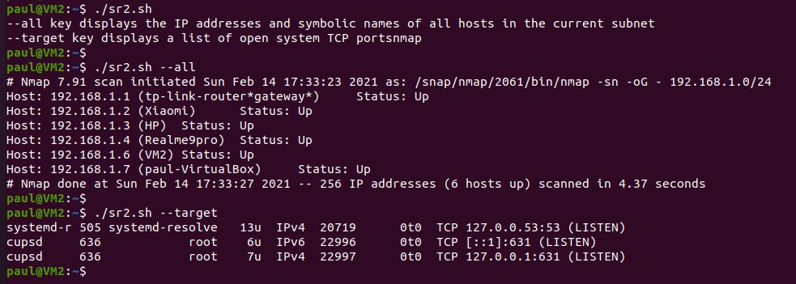
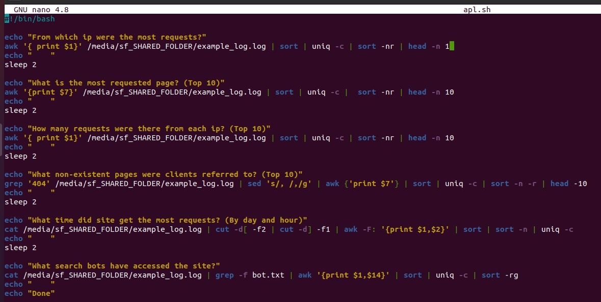
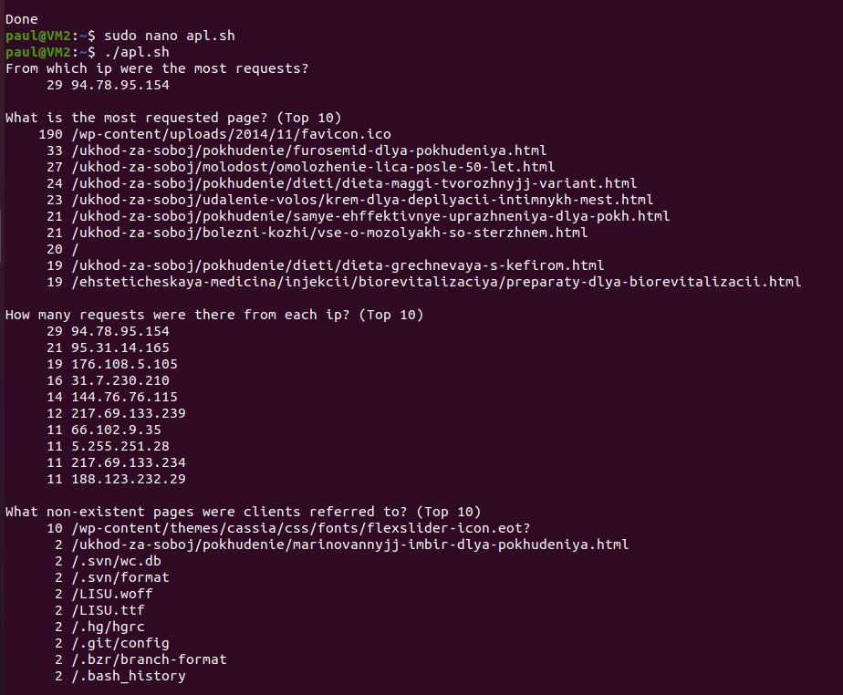
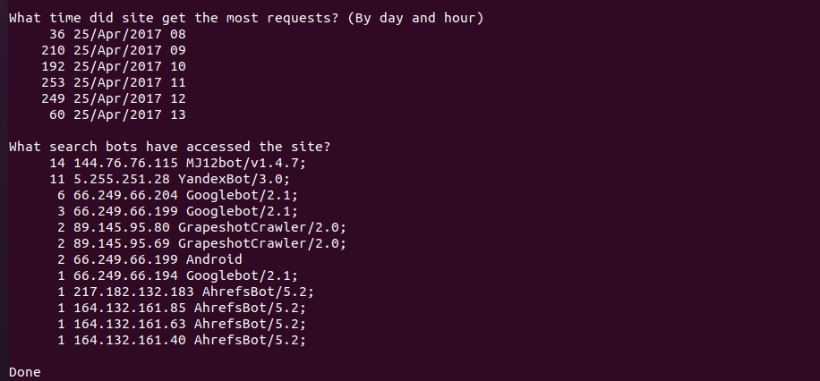
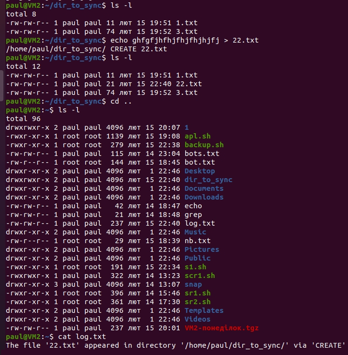
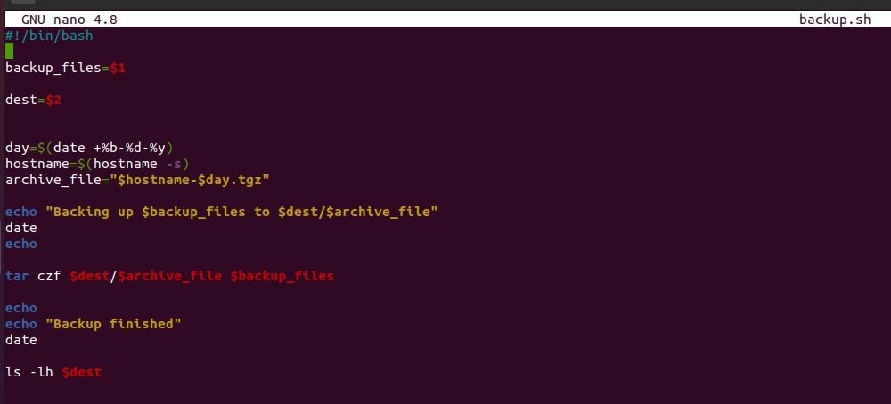
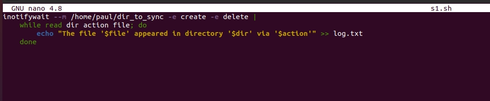
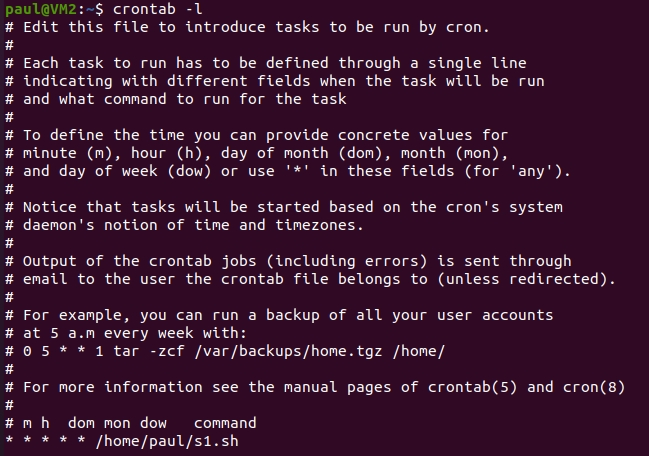

## Task 7.1

## A. Create a script that uses the following keys: --all that displays the IP addresses and symbolic names of all hosts in the current subnet (using `nmap` utility),--target that displays a list of open system TCP ports (using `lsof` command) and without keys it displays info about keys.

## B. Using Apache log example create a script to answer the following questions:

## C. Create a data backup script:

  

   
