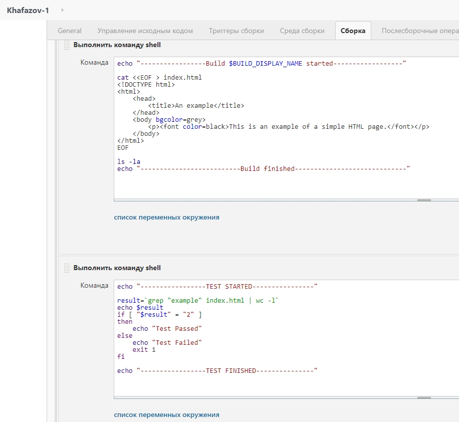

## Task 8.1

Description: one VM (192.168.1.6) with Jenkins, another VM (192.168.1.5) with Apache server. Aim: to create and deploy index.html from one VM to another using Jenkins (Publish over SSH plugin).
Installed Jenkins (long term release) on Ubuntu 20.04 (needed to install Java). Entered 192.168.1.6 port 8080 to customize Jenkins ( to do this I had to enter initial key from var/lib/jenkins/secrets/initialAdminPassword). Generated SSH key pair and trancfered public key to Apache VM, configured Publish over SSH settings. _I've got a problem with SSH key format (Publish over SSH didn't support new SSH key format which is used by default), so I've used the old PEM format._ 

Results:

