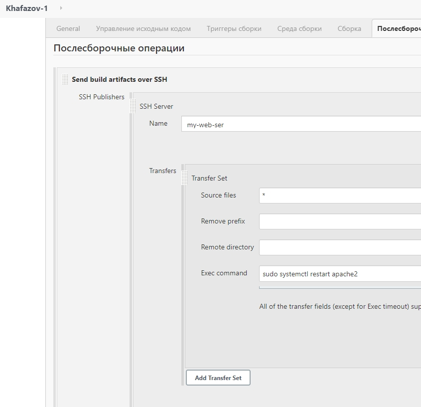

## Task 8.1

Installing Jenkins (long term release) on Ubuntu 20.04 (VM - paul-VirtualBox) (needed to install Java):
   

Starting Jenkins and checking status:

Entering 192.168.1.7 port 8080 to customize Jenkins ( to do this I had to enter initial key from var/lib/jenkins/secrets/initialAdminPassword):

Entering as a user jenkins and generating SSH key pair:

Logging to another VM (VM1) as a root and copying SSH public ket into .ssh/authorized_keys:

And checking connection from VM paul-VirtualBox to VM1:

