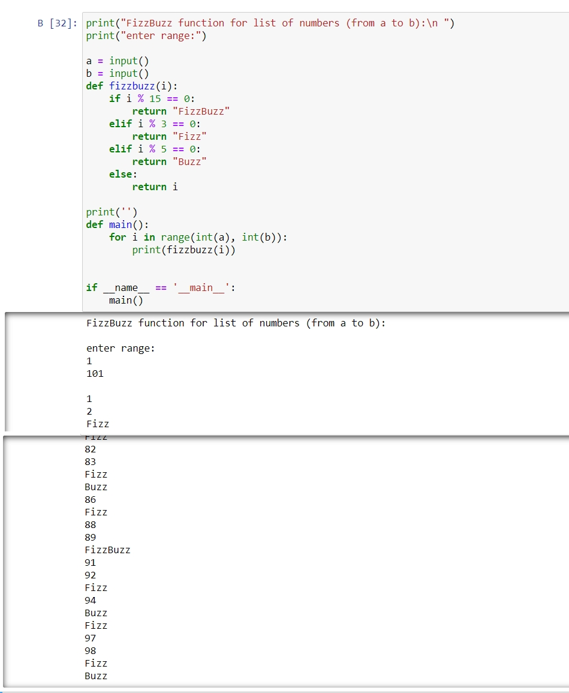
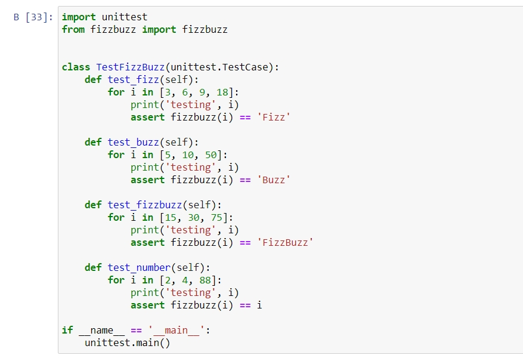
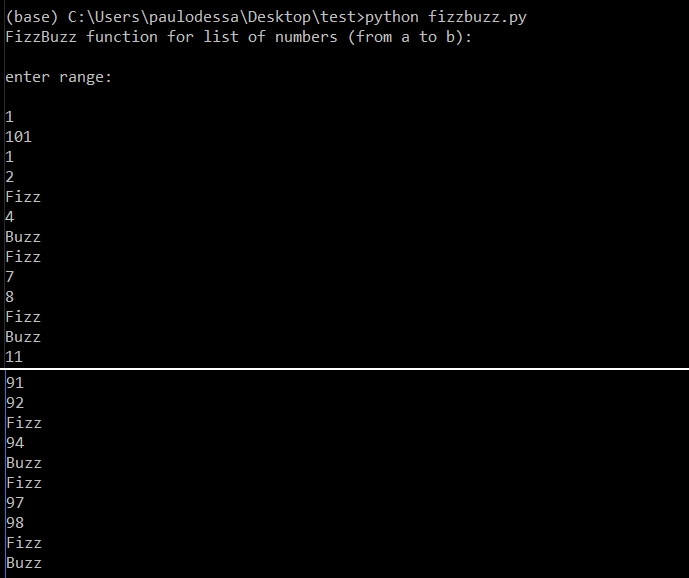
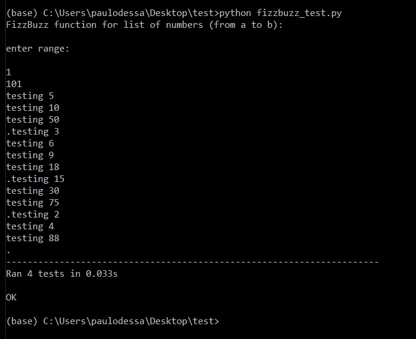
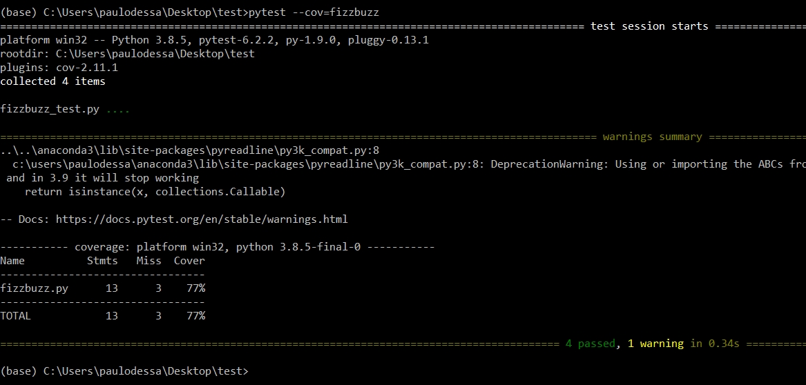
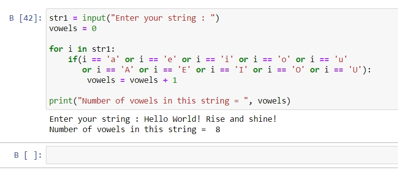
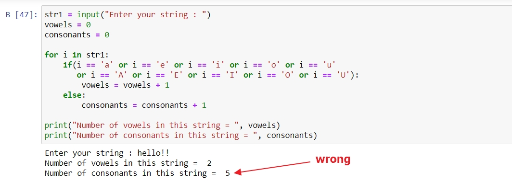
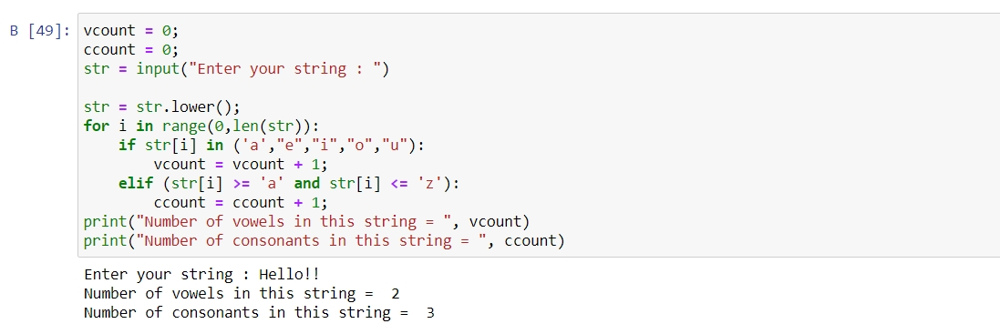

## Task 9.1

## 1. Developing FizzBuzz function 

**FizzBuzz function** for list of inputed range of numbers from 'a' to 'b' (in our case from 1 to 100):

**Unit test for FizzBuzz function** ( with TestCase classes that include a methods to test for "Fizz", "Buzz", "FizzBuzz" and the numbers aren't divisible by 3 or by 5):

Results:

Test coverage:

## 2. Developing function for counting vowels:

User must enter a string and store it in a variable. The count variable is initialized to zero, for loop is used to traverse through the characters in the string, if statement checks if the character is a vowel or not. The count is incremented each time a vowel is encountered. And then the total count of vowels in the string is printed.

To count consonants:

_I've got a problem when was trying to count consonants because of noletter symbols. To corect this mistake used: converting entire string to lower case to reduce the comparisons, then hecking whether a character is a vowel and reducing counting range exceptionally to letters (from a to z) `elif (str[i] >= 'a' and str[i] <= 'z')`:

